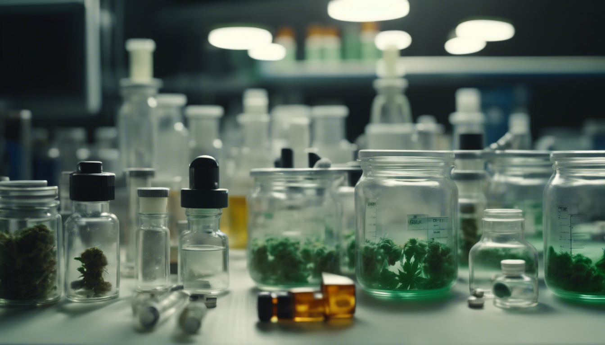

## Research: Health Policy and Innovation  <small><i>(as Research Assistant)</i></small>

During my MSc studies I worked as a Research Assistant to <a href="https://www.lucyxiaoluwang.com/">Lucy Xiaolu Wang</a>, first at the Max Planck Institute for Innovation and Competition and later at the University of Massachussetts Amherst. Prof. Wang's research focuses on the economics of innovation and digitization in healthcare.

_As co-author_

Wang, L. X., & Wilson, N. J. (2022). US State approaches to cannabis licensing. International Journal of Drug Policy, 106, 103755.
Media: 

Download: <a href="https://doi.org/10.1016/j.drugpo.2022.103755">IJDP</a> | 
<a href="https://ssrn.com/abstract=4125055">MPI</a> |
<a href="https://papers.ssrn.com/sol3/papers.cfm?abstract_id=3953347">SSRN</a> |
<a href="https://www.lucyxiaoluwang.com/_files/ugd/b7b79b_d2b41812a8b049a09520f1434c5b5711.pdf">slides</a> |
<a href="https://github.com/LucyXiaoluWang/US_state_cannabis_licensing">data</a>

Media: <a href="https://twitter.com/LucyXiaolu_Wang/status/1536343474949083139">X</a> |
<a href="https://www.umass.edu/news/article/new-study-umass-amherst-researcher-examines-differing-state-approaches-cannabis">news@UMass</a> | 
<a href="https://www.marijuanamoment.net/doj-to-address-cannabis-in-days-ahead-ag-says-newsletter-june-17-2022/">Marijuana Moment</a> |
<a href="https://www.mmjdaily.com/article/9438717/us-new-study-examines-differing-state-approaches-to-cannabis-licensing/">MMJDaily</a> | 
<a href="https://www.benzinga.com/markets/cannabis/22/06/27834377/a-new-study-analyzes-u-s-state-approaches-to-cannabis-licensing">Benzinga</a> 

_Acknowledged as providing research assistance_

Kreyer, A. C., & Wang, L. X. (2022). Collaborating neuroscience online: The case of the Human Brain Project forum. Plos one, 17(12), e0278402.

Wang, L. X., & Chan, N. W. (2023). Legalization and Innovation in the Cannabis Market. Available at SSRN 4373615.

Wang, L. X., & Zahur, N. B. (2023). Procurement institutions and essential drug supply in low and middle-income countries. Available at SSRN 3926761.
